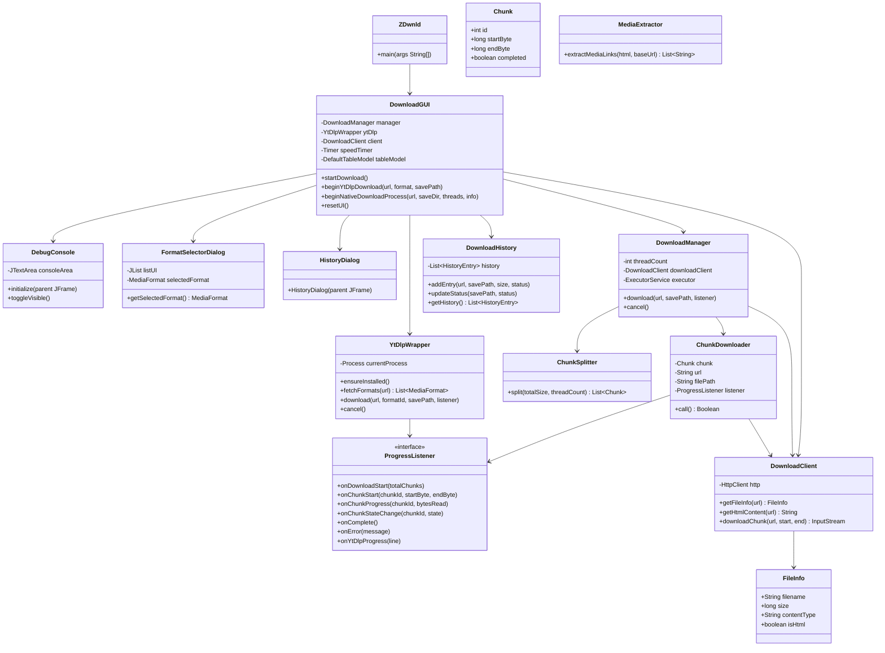
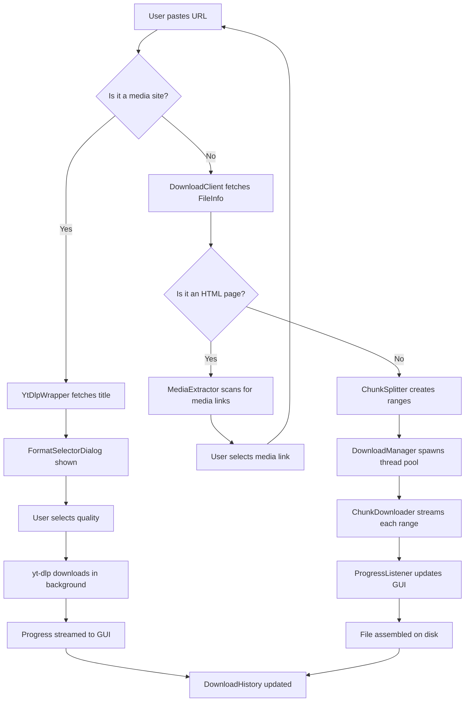

# zDwnld

A high-performance, multi-threaded Java desktop download manager with a modern dark-themed GUI, integrated yt-dlp media extraction, persistent download history, and native Windows packaging.

---

## Table of Contents

- [Overview](#overview)
- [Features](#features)
- [Architecture](#architecture)
- [Class Diagram](#class-diagram)
- [Package Structure](#package-structure)
- [Technology Stack](#technology-stack)
- [Build and Run](#build-and-run)
- [Building a Native Installer](#building-a-native-installer)
- [Usage Guide](#usage-guide)
- [Download Flow](#download-flow)
- [License](#license)

---

## Overview

zDwnld is a Java Swing desktop application that replicates and extends the functionality of commercial download managers such as IDM. It supports multi-threaded HTTP chunk downloading, seamless resume capability, and YouTube/media site downloading via a bundled yt-dlp engine. The GUI features a dark theme with orange and neon-blue visual accents, a live progress dashboard, and a built-in debug console.

---

## Features

- Multi-threaded HTTP downloading with configurable thread count
- Automatic file splitting into chunks for maximum bandwidth utilization
- Resume support using persistent .meta state files
- Real-time per-chunk progress bars with speed and ETA display
- yt-dlp integration for YouTube, Vimeo, Twitter, and 1000+ media sites
- Quality selector dialog for choosing 4K, 1080p, 720p, or audio-only formats
- Automatic yt-dlp.exe download on first launch (no manual setup required)
- HTML media grabber that scans webpages for video and audio tags
- Pause and cancel controls for active downloads
- Persistent download history stored in a local JSON database
- Quick open folder button from both main GUI and history dialog
- Built-in debug console that captures all System.out and System.err output in real time
- Native Windows portable app build via jpackage (no Java installation required by end users)

---

## Architecture

The application is divided into three packages:

- `core` handles the download engine: chunk splitting, parallel downloading, progress tracking, and history management.
- `network` handles all HTTP communication, file metadata parsing, media link extraction, and the yt-dlp process wrapper.
- `gui` handles all Swing UI components: the main window, format selector, history dialog, and debug console.

The entry point is `ZDwnld.java`, which initializes the FlatDarkLaf theme and launches the `DownloadGUI` window on the Swing event dispatch thread.

---

## Class Diagram



---

## Package Structure

```
zDwnld/
├── pom.xml
├── Icon.png
├── Icon.ico
├── build_installer.bat
├── make_icon.ps1
└── src/
    └── main/
        └── java/
            └── opensource/DlacInc/ZDwnld/
                ├── ZDwnld.java                   (entry point)
                ├── core/
                │   ├── Chunk.java                (byte range descriptor)
                │   ├── ChunkSplitter.java         (splits file into ranges)
                │   ├── ChunkDownloader.java       (downloads one chunk)
                │   ├── DownloadManager.java       (orchestrates all chunks)
                │   ├── DownloadHistory.java       (persistent history JSON)
                │   └── ProgressListener.java      (callback interface)
                ├── network/
                │   ├── DownloadClient.java        (HTTP client)
                │   ├── FileInfo.java              (parsed HTTP metadata)
                │   ├── MediaExtractor.java        (HTML media scanner)
                │   └── YtDlpWrapper.java          (yt-dlp process manager)
                └── gui/
                    ├── DownloadGUI.java           (main application window)
                    ├── DebugConsole.java          (floating debug terminal)
                    ├── FormatSelectorDialog.java  (quality picker dialog)
                    └── HistoryDialog.java         (download history viewer)
```

---

## Technology Stack

| Component        | Technology                          |
|-----------------|--------------------------------------|
| Language         | Java 26                             |
| GUI Framework    | Java Swing with FlatDarkLaf 3.4     |
| HTTP Client      | java.net.http.HttpClient            |
| JSON             | Google Gson 2.10.1                  |
| Media Backend    | yt-dlp (auto-downloaded at runtime) |
| Build Tool       | Apache Maven                        |
| Packaging        | jpackage (JDK 26 built-in)          |

---

## Installation and Setup

### For Users (Standalone EXE)
1. Head to the **Releases** page on GitHub.
2. Download the standalone `zDwnld_portable.exe` file.
3. Double-click it to run. No Java runtime or installation is required by you.
   * *Note*: On the first run, the executable will extract its minimized runtime package to `%LOCALAPPDATA%\zDwnld_portable\`. Subsequent runs are instantaneous.

### Browser Extension Setup (Chrome/Edge/Brave/Opera)
1. Open your browser and navigate to `chrome://extensions/` (or `edge://extensions/`).
2. Toggle the **Developer mode** switch (usually in the top-right corner).
3. Click the **Load unpacked** button.
4. Select the `browser-extension` folder located inside the `zDwnld` repository folder.
5. Keep the `zDwnld_portable.exe` app open. The extension will now automatically detect download links or HTML media and display a floating **Download with zDwnld** badge.

---

## Building from Source

### Requirements
- JDK 26.0.1 or higher
- Apache Maven

### Dev Build and Run
```bash
git clone https://github.com/0xRoS-200/zDwnld.git
cd zDwnld
mvn compile exec:java
```

### Packaging a Standalone Portable EXE (Release)
To compile a single self-contained executable with the application icon embedded, execute:
```powershell
powershell -ExecutionPolicy Bypass -File .\build_single_exe.ps1
```
This script will:
1. Compile the sources and shade dependencies into a single fat JAR.
2. Run `jpackage` to build the app package.
3. Zip the package and embed it as a resource in a C# launcher compiled via the built-in Windows `csc.exe` compiler.
4. Clean up temporary files, outputting the final `zDwnld_portable.exe`.

---

## Usage Guide

**Standard HTTP Download**

1. Paste any direct file URL into the URL field.
2. Select a destination folder using the Browse button or leave the default.
3. Set the number of download threads (default: 8).
4. Click Start / Resume.

**YouTube and Media Site Download**

1. Paste a YouTube, Vimeo, or Twitter URL.
2. The app will automatically fetch the video title and present a quality selection dialog.
3. Select the desired quality (4K, 1080p, 720p, Audio Only, etc.) and click Download.
4. Progress is tracked in real time via yt-dlp output.

**Pause and Resume**

- Click Pause to interrupt an active download. The .meta file preserves the download state.
- Click Start / Resume with the same URL to continue from where it stopped.

**Download History**

- Click the History button to view all past downloads.
- Each entry shows the URL, filename, status, and an Open Folder button.

**Debug Console**

- Click the gear button to open the floating debug console.
- All engine output including raw yt-dlp terminal lines is streamed here in real time.

---

## Download Flow



---

## License

This project is open-source. Contributions and pull requests are welcome.

