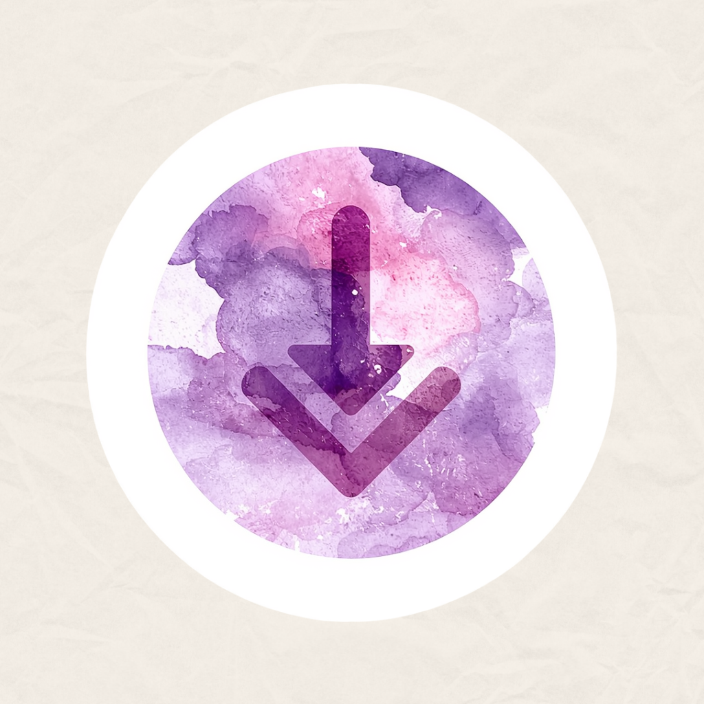

# zDwnld

**zDwnld** is a high-performance, multi-threaded Java download manager featuring a premium dark-themed GUI, integrated `yt-dlp` media extraction, and real-time speed/ETA analytics.



## 🚀 Key Features

- **High-Speed Multi-threading**: Splits files into segments for maximum bandwidth saturation.
- **Modern IDM-Style UI**: Sleek dark mode aesthetics with vibrant orange accents and neon-blue progress tracking.
- **Universal Media Grabber**: Integrated `yt-dlp` backend that automatically fetches video/audio from YouTube, Twitter, Vimeo, and 1000+ other sites.
- **Quality Selector**: One-click prompts to choose between 4K, 1080p, 720p, or "Audio Only" formats.
- **Pause & Resume**: Native support for partial downloads with persistent state tracking.
- **Download History**: A searchable, persistent database of all your past downloads with "Quick Open" folder support.
- **Live Debugger Console**: Built-in real-time terminal tab to monitor engine logs and `yt-dlp` output.
- **Zero Config**: Automatically handles its own dependencies (`yt-dlp.exe`).

## 🛠️ Requirements

- **Java 21+** (for latest features)
- **Maven** (for building)

## 🏗️ Build & Run

1. Clone the repository:
   ```bash
   git clone https://github.com/0xRoS-200/zDwnld.git
   ```
2. Navigate to the directory:
   ```bash
   cd zDwnld
   ```
3. Compile and run:
   ```bash
   mvn compile exec:java
   ```

## 📜 License

This project is open-source. Feel free to use and contribute!
